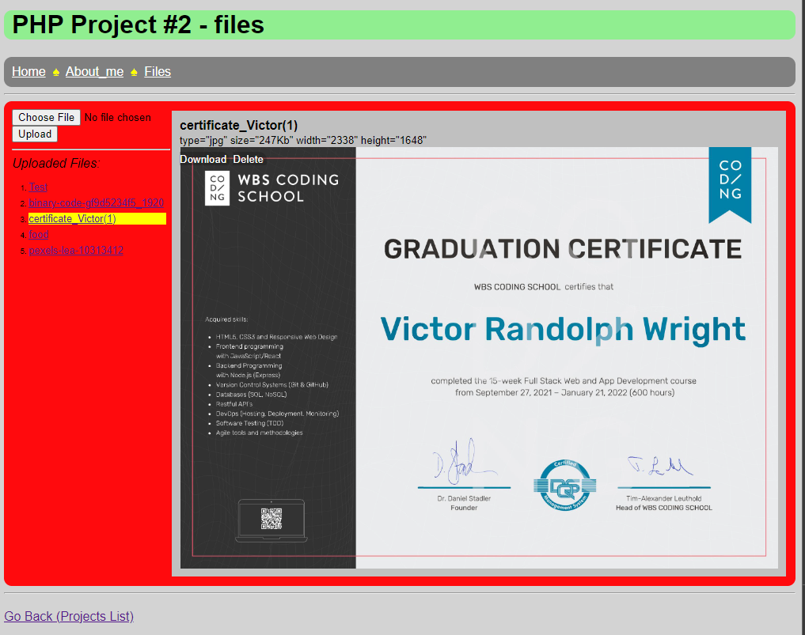

# my php project #2 - files

>This is a project to explore file activities such as uploads/listing/downloads etc.

*File "uploads" only works (for the moment) on localhost.*

* The git "README.md" file (this) is sanitized and directly read into the site page's "description" <div..> inside <pre..> tags.

<pre>
Developer:   Victor Wright
Client:      Self
Date:        30 Jun 2022
Deployed V1: <a href="https://php2-files.vercel.app">https://php2-files.vercel.app</a>
GH Page:     <a href="https://vrw-gh.github.io/php-p2/">vrw-gh.github.io/php-p2</a>
</pre>
